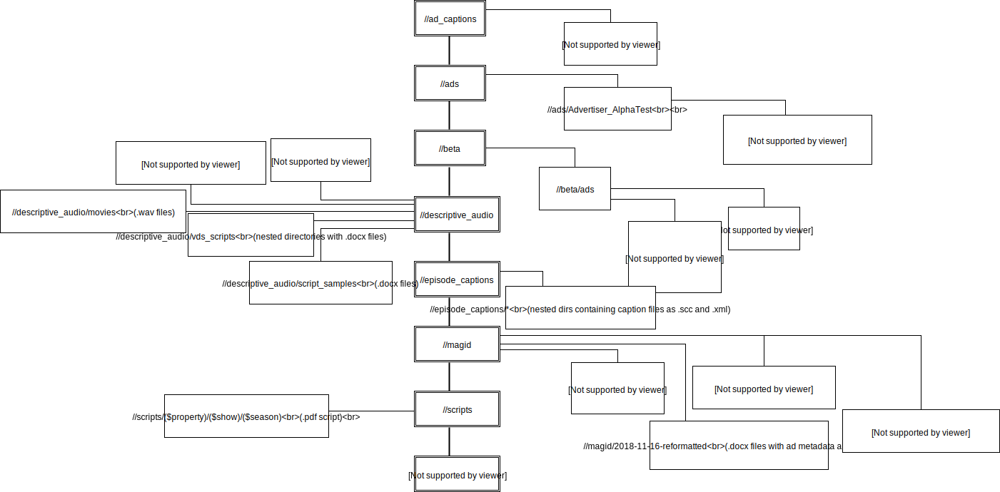

## Dependencies
* python 3
* using open source tool to aid report generation [ocrevalUAtion](https://github.com/impactcentre/ocrevalUAtion)
* java 1.8

use `environment.yml file to install anaconda environment to satisfy all python depenedencies`

## Files in this repo
* convert script between `.scc`->`.txt` (pbs pycaption) and `.pdf|.docx|.doc`->`.txt` (apache tika): [conversion.py](conversion.py)
* main interface to run ocr evaluation tool [ocr_eval_main.py](ocr_eval_main.py)
* helper functions to generate reports for ocr evaluation tool [ocr_report_generator.py](ocr_report_generator.py)
* conda environment: [environment.yml](environment.yml)
* ocrevalUAtion ocr evaluation tool jar [ocrevaluation.jar](ocrevaluation.jar)
* dependencies for ocrevalUAtion ocr evaluation tool jar to use [mvn-repo](mvn-repo/)

## Commands
### Run Tika OCR tool
`python conversion.py "directory with `.pdf|.docx|.doc` files to be ocr-ed"`
### Run pycaption conversion tool
`python conversion.py "directory with `.scc` files to be converted"`

## Structure of Dataset Available
<figure>

<figcaption> Figure 1: Structure of `gmo` dataset on s3 </figcaption>
</figure>

## References
1) Eugene Borovikov. [A survey of modern optical character recognition techniques](https://arxiv.org/pdf/1412.4183.pdf). arXiv:1412.4184v1, December 2014.
2) John Makhoul, Francis Kubala, Richard Schwartz, Ralph Weischedel. [Performance Measures For Information Extraction](http://citeseerx.ist.psu.edu/viewdoc/summary?doi=10.1.1.27.4637). In Proceedings of DARPA Broadcast News Workshop, 1999.
3) Vladimir Levenshtein. [Binary codes capable of correcting deletions, insertions, and reversals](https://nymity.ch/sybilhunting/pdf/Levenshtein1966a.pdf). Soviet Physics Doklady. 10 (8): 707–710. Bibcode:1966SPhD...10..707L, February 1966.